# **Creating & Integrating a Chatbot using AWS Lex AI Service into a Website**

## **Overview**
This project involves creating an **intelligent chatbot** using **Amazon Lex** to assist customers in scheduling **Google Meet** sessions based on their interest in the technologies I offer. The chatbot is integrated into a **portfolio website**, providing a seamless and interactive user experience.

## **What We Will Achieve in This Project**
- **Broadcast Link**: [**See the Bot in Action**](https://drive.google.com/file/d/1FRx-fWnkLwDNESBBVaJtUeRdjVDyc3lx/view?usp=sharing)

## **Table of Contents**
- [**Project Overview**](#overview)
- [**System Architecture**](#system-architecture)
- [**Prerequisites**](#prerequisites)
- [**Steps to Implement**](#steps-to-implement)
  1. [**Login to AWS Management Console**](#1-login-to-aws-management-console)
  2. [**Create a New Lex Bot**](#2-create-a-new-lex-bot)
  3. [**Define Intents**](#3-define-intents)
  4. [**Create Slots**](#4-create-slots)
  5. [**Configure Slot Prompts**](#5-configure-slot-prompts)
  6. [**Confirmation**](#6-confirmation)
  7. [**Fulfillment**](#7-fulfillment)
  8. [**Build the Bot**](#8-build-the-bot)
  9. [**Test the Bot**](#9-test-the-bot)
  10. [**Integrate the Bot into Your Website**](#10-integrate-the-bot-into-your-website)
  11. [**Monitor and Improve**](#11-monitor-and-improve)
- [**Key Learnings**](#key-learnings)
- [**GitHub Repository**](#github-repository)
- [**Related Links and Resources**](#related-links-and-resources)

## **System Architecture**

## **Prerequisites**
- **AWS Account** with access to **Lex**, **IAM Role**, and other related services.
- Basic knowledge of **AWS Lex AI Service** and **web development**.

## **Steps to Implement**

### **1. Login to AWS Management Console**
- **Description**: Sign in to AWS Management Console using your AWS credentials.
- 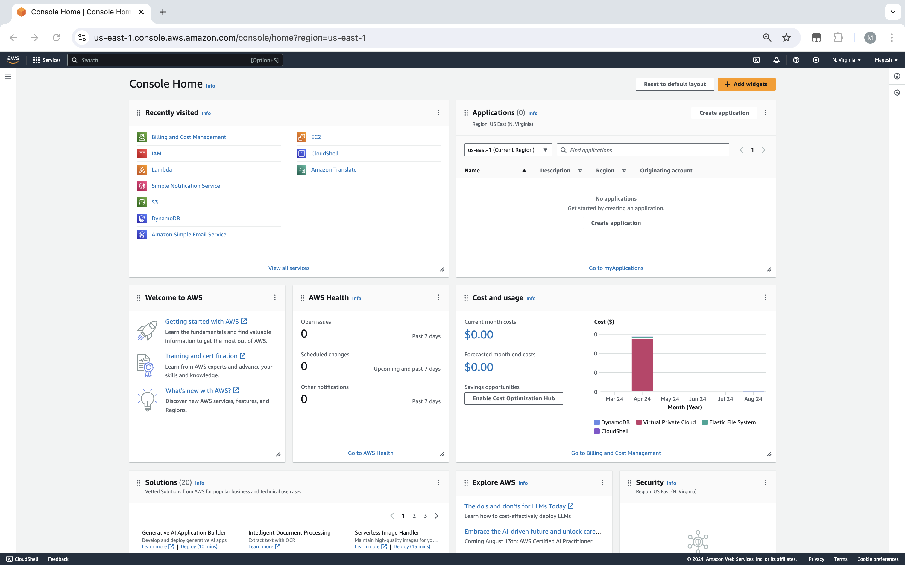

### **2. Create a New Lex Bot**
- **Description**: This step involves creating a new bot in **Amazon Lex** with the necessary configurations.
- Navigate to the **Amazon Lex Dashboard**.
  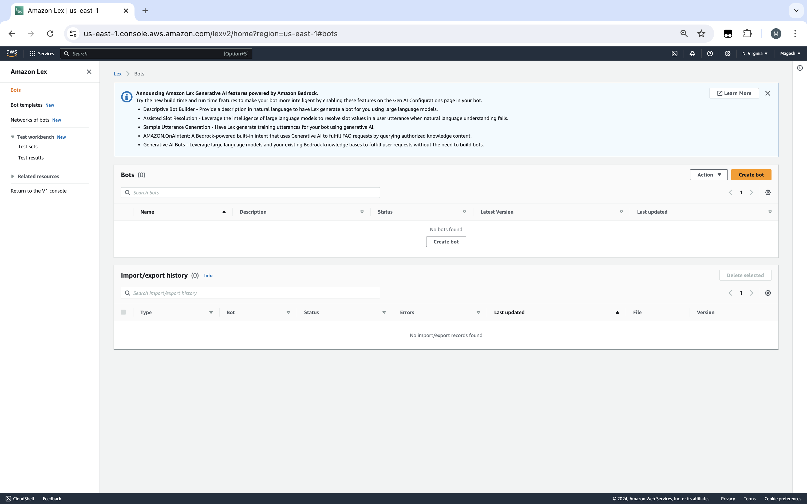
- Select a blank Bot and give the bot name "**TechConsultationBot**".
- Select the basic **Amazon Lex IAM Permission**.
  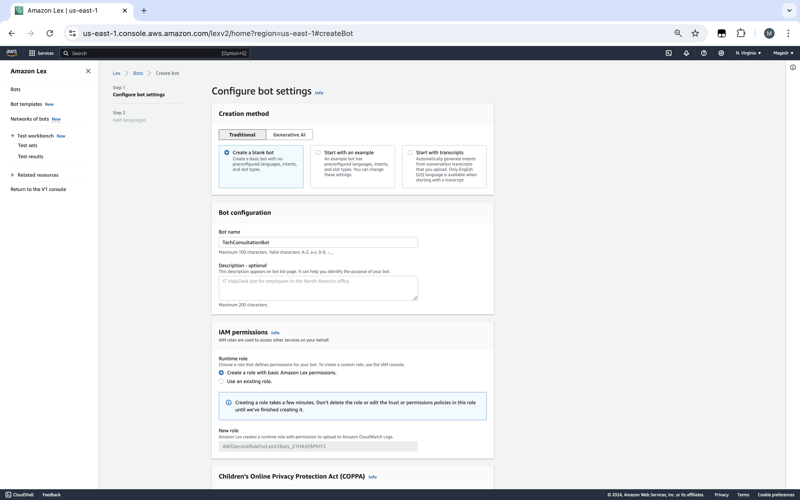
- Select the **bot language**.
  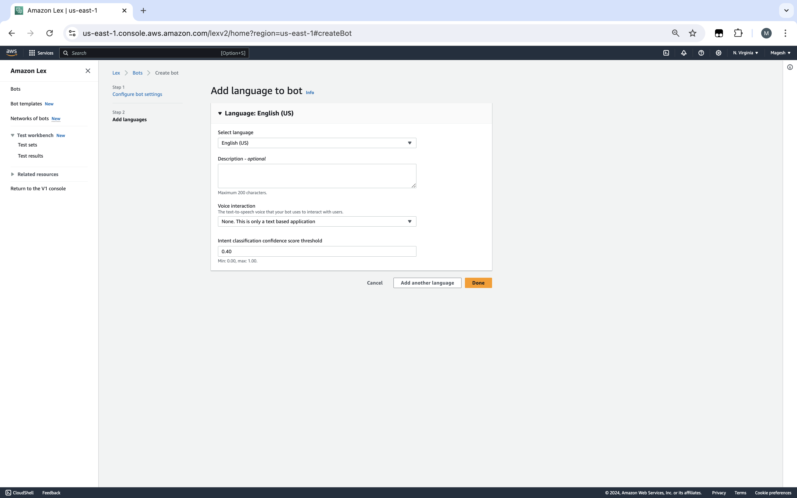
- Click on "**Done**" and AWS will start creating the bot.
  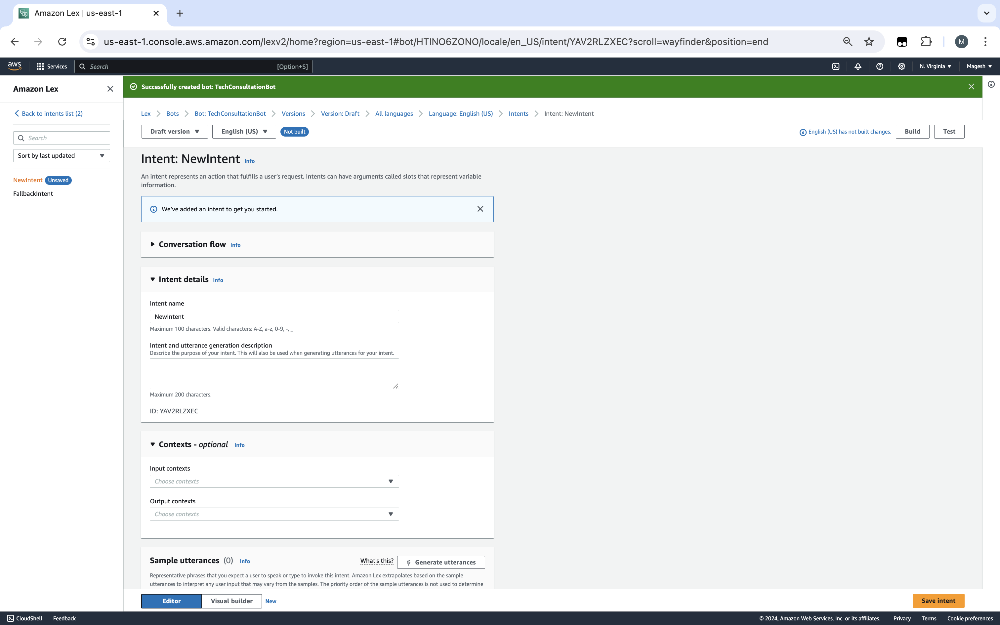

### **3. Define Intents**
- **Description**: Define the **intents** that the bot will handle, such as scheduling a consultation.
- Provide Intent Name: `ScheduleTechConsultation`.
  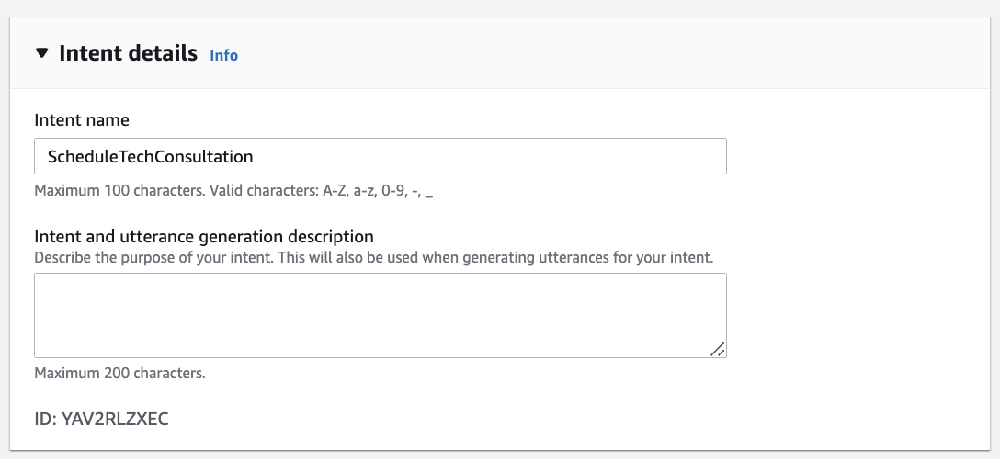
- Sample Utterances: Include phrases like "**I want to schedule a consultation**," "**Book a Google Meet**," "**I need help with AWS**."
  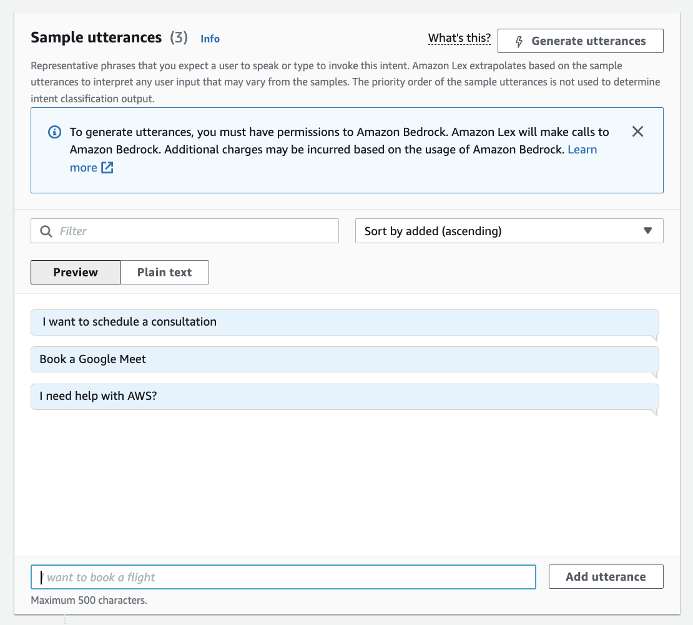

### **4. Create Slots**
- **Description**: Create **slots** to capture specific user inputs like **FirstName**, **EmailAddress**, **TechnologyInterest**, **Date**, and **Time**.
- **Custom Slot Types**: Add **custom slot types** for your business purpose.
  - Navigate to the **custom slot type dashboard**.
    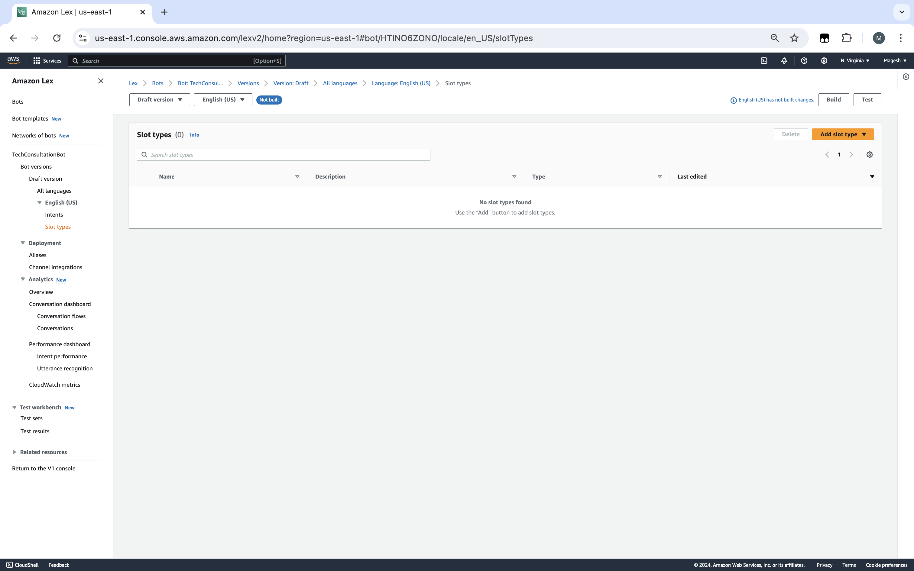
  - Provide Slot Name: `TechnologyInterest`.
    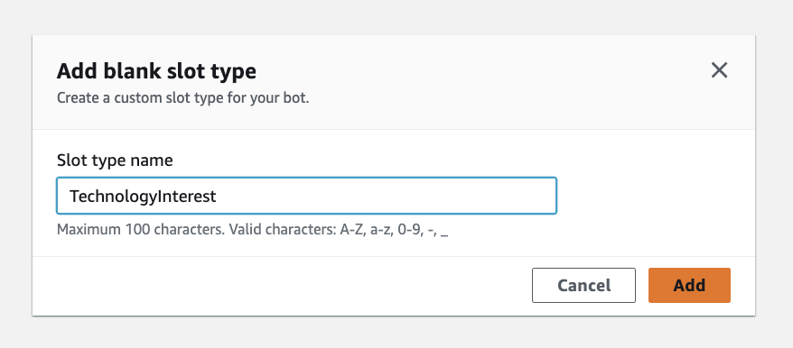
  - Provide Slot Types: `AWS`, `AI`, `Automation`, `DevOps`, `Software Development`.
    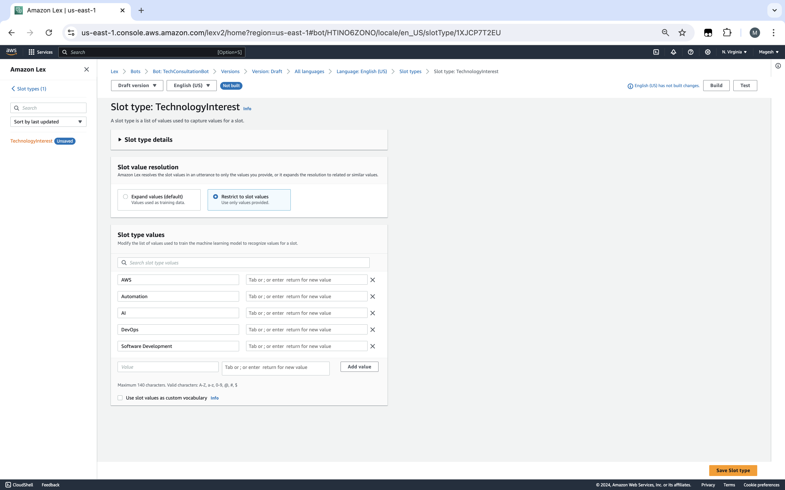
- **Existing Slot Types**: Add existing slot types such as `FirstName`, `EmailAddress`, `Date`, and `Time`.
  - Adding Slot: `FirstName`.
    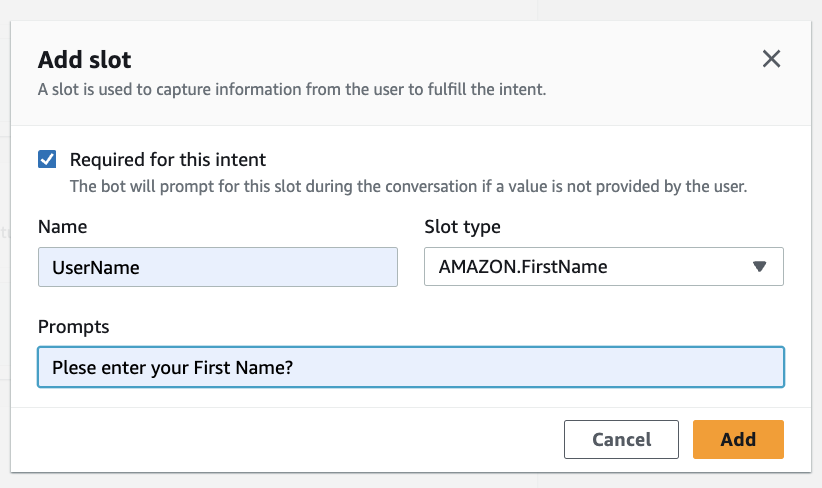
  - Adding Slot: `EmailAddress`.
    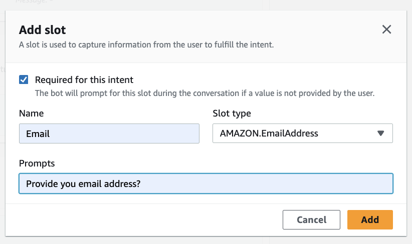
  - Adding Slot: `Date`.
    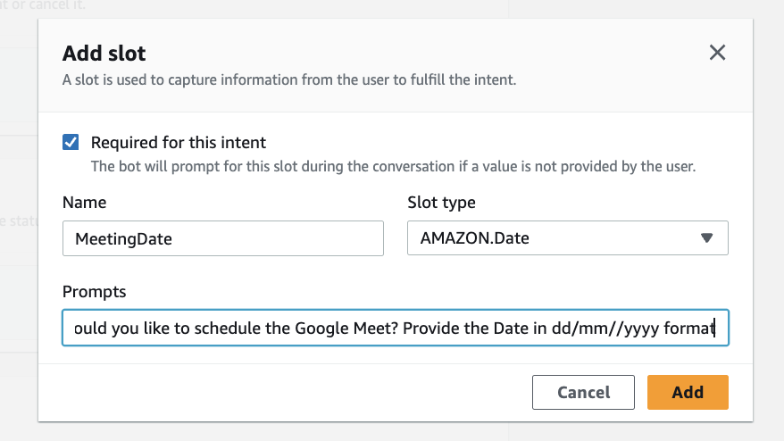
  - Adding Slot: `Time`.
    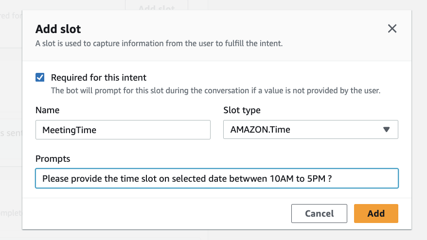

### **5. Configure Slot Prompts**
- **Description**: Set **prompts** for each slot to guide the user through the conversation.

### **6. Confirmation**
- **Description**: Set the **confirmation** and decline prompts for the bot.
  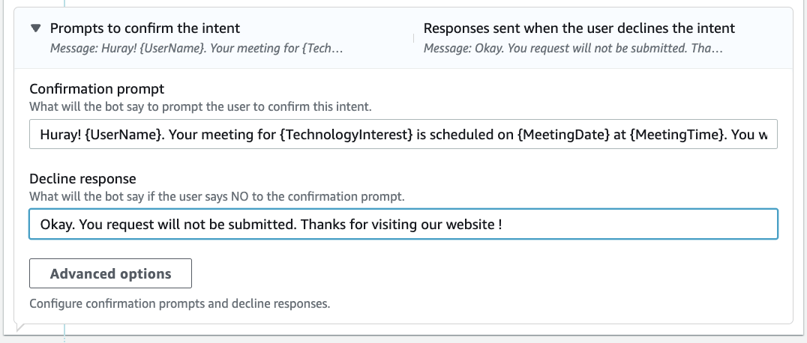

### **7. Fulfillment**
- **Description**: Connect the **intent** to schedule the meeting and send **confirmations**.
  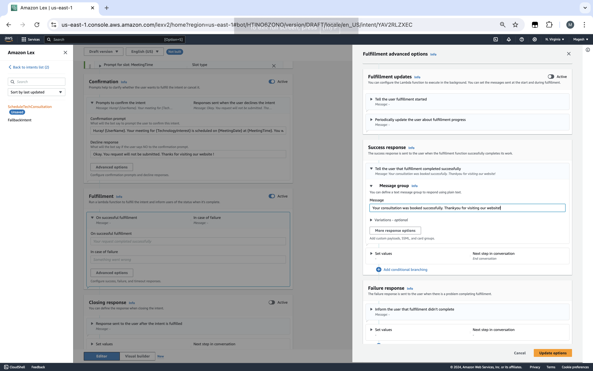

### **8. Build the Bot**
- **Description**: Build the bot to apply all configurations.
  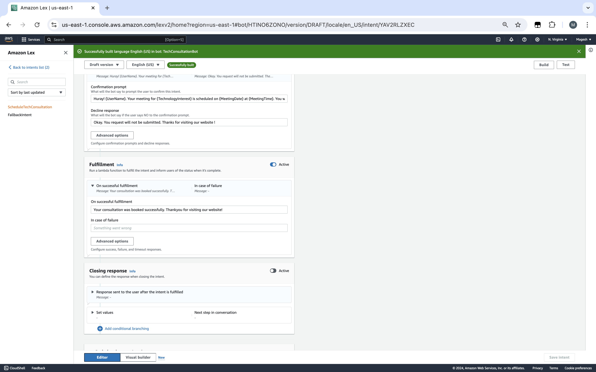

### **9. Test the Bot**
- **Description**: Test the bot in the **Amazon Lex console** to ensure correct behavior.
- **Video Link**: [**See the Bot in Action**](https://drive.google.com/file/d/1Q0gGkB0cft9X2y26yLKDVzDNcCqUlEJQ/view?usp=sharing)
- **Details**:
  - **Simulate user interactions** and refine the bot as needed.

### **10. Integrate the Bot into Your Website**
- **Description**: Embed the bot into your **portfolio website** for user interaction.
  - **Customize the UI** to match your website design.
  - **Deployment**: Use Kommunicate AI-Powered Customer Service Automation Platform for easy integration [Website](https://www.kommunicate.io/)

### **11. Monitor and Improve**
- **Description**: Continuously **monitor** the bot's performance and make **improvements** based on user feedback.

## **Key Learnings**
- Integration of **AWS AI services** like **Lex**.
- Understanding the importance of **user experience** in chatbot design.
- Enhancing skills in **deploying chatbots** on web platforms.

## **GitHub Repository**
- **Link**: [**GitHub**](https://lnkd.in/gMU2FF_m)

## **Related Links and Resources**
- **AWS Lex Documentation**: [Amazon Lex Documentation](https://docs.aws.amazon.com/lex/)
- **AWS AI Services Overview**: [AWS AI Services](https://aws.amazon.com/machine-learning/ai-services/)
- **Getting Started with AWS Lex**: [AWS Lex Getting Started Guide](https://docs.aws.amazon.com/lex/latest/dg/getting-started.html)
